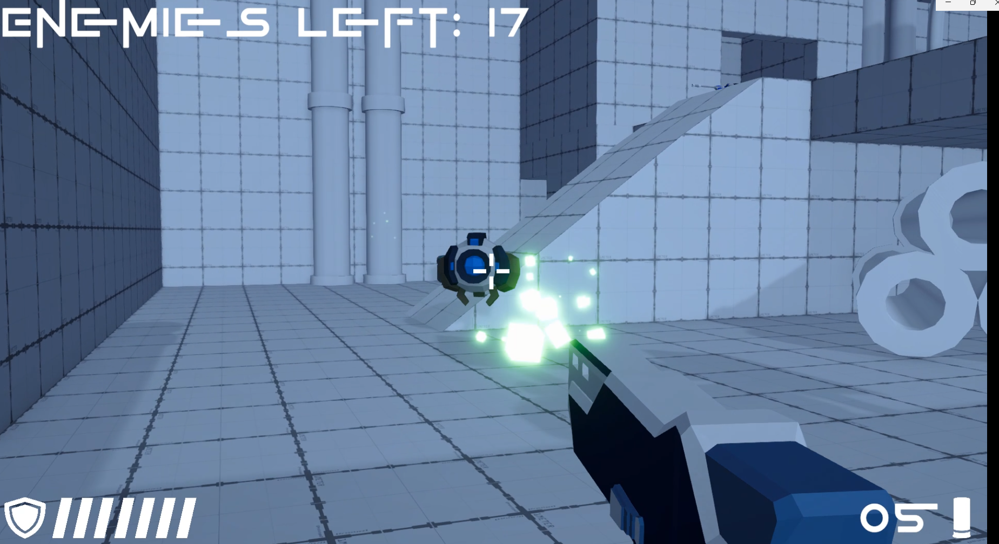
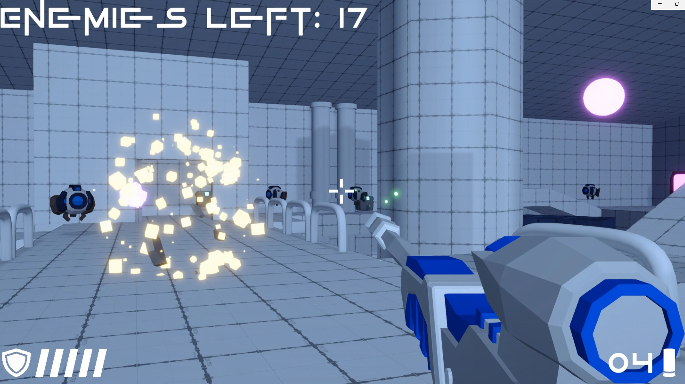
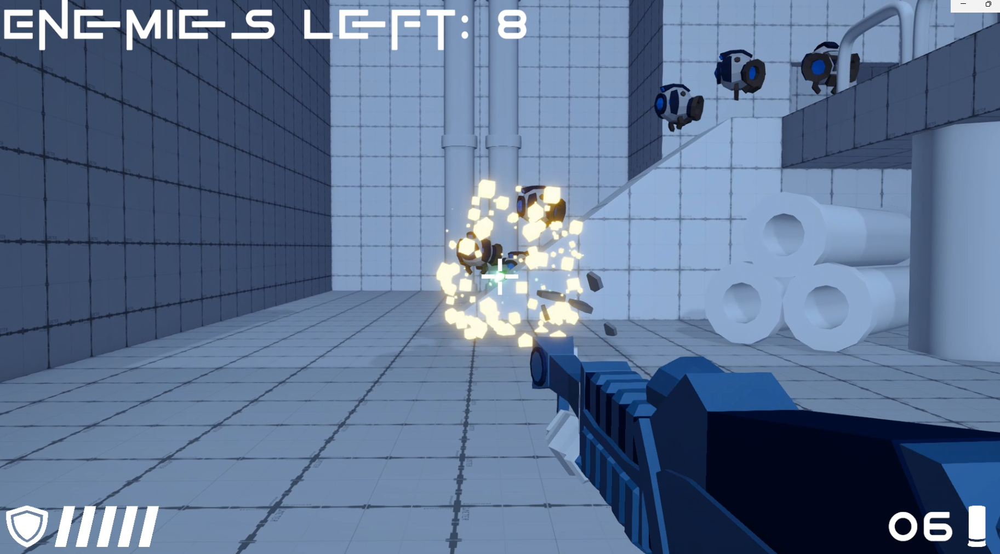

# Sharp Shooter

> Unity 3D 슈팅 액션 게임 — 총과 탄약을 수집하고, 일정 주기마다 생성되는 적과 스폰 게이트를 모두 파괴하면 클리어.
> A Unity 3D shooting action game where the player collects guns and ammo, destroys enemies and spawn gates that appear periodically.

<p align="center">
  <a href="#demo">🎮 플레이 영상</a> •
  <a href="#features">🔫 주요 특징</a> •
  <a href="#tech-stack">🧰 기술 스택</a> •
  <a href="#setup">⚙️ 설치/실행</a> •
  <a href="#screenshots">🖼️ 스크린샷</a>
</p>

<p>
  
  
</p>

---

## TL;DR

* **장르**: 3D 슈팅 액션 게임
* **엔진**: Unity 6.0
* **역할(Role)**: 기획 100%, 프로그래밍 100%
* **목표**: 생성되는 적과 스폰 게이트를 모두 파괴하면 클리어
* **플레이타임**: 약 10 ~ 15분

---

<h2 id="demo">🎮 플레이 영상</h2>

* ▶️ **Gameplay Video**: (추가 예정)

> 플레이어는 필드에서 총과 탄약을 수집하고, 주기적으로 생성되는 적과 스폰 게이트를 파괴해야 합니다.

---

<h2 id="features">🔫 주요 특징 / Features</h2>

* 🔫 **슈팅 시스템** — 총기 발사, 탄약 소모, 스나이퍼 줌인 모드 구현
* 🎯 **적 전투 시스템** — 적 AI 추격 및 공격
* 🚪 **스폰 게이트 시스템** — 일정 주기마다 적 생성, 게이트 파괴 시 스폰 중단
* 📦 **아이템 픽업 시스템** — 총기 및 탄약 자동 획득
* ❤️ **체력 및 데미지 시스템** — 피격, 사망 처리
* 🎥 **1인칭 카메라 시스템** — 플레이어 추적 및 전투 시점 유지

---

<h2 id="tech-stack">🧰 기술 스택 / Tech Stack</h2>

**엔진**: Unity 6.0 (URP)  
**언어**: C#  

**툴체인**: Visual Studio / Git / Blender / Audacity  

**핵심 시스템 구성**:

| 시스템 | 설명 |
|--------|------|
| **Shooting System** | Raycast 기반 총기 발사 및 히트 판정 |
| **Enemy AI** | NavMesh 기반 추격 및 공격 로직 |
| **Spawn System** | 일정 주기 적 생성 및 게이트 관리 |
| **Health System** | 플레이어/적 체력 및 데미지 처리 |
| **Inventory Lite** | 총기 및 탄약 획득 |
| **Cinemachine** | 카메라 추적 |

---

<h2 id="architecture">🏗️ 프로젝트 구조 / Architecture</h2>

```
Assets/
    Enemies/
        EnemyHealth.cs
        Explosion.cs
        Projectile.cs
        Robot.cs
        SpawnGate.cs
        Turret.cs
    Misc/
        BGMManager.cs
        GameManager.cs
    Pickups/
        AmmoPickup.cs
        Pickup.cs
        WeaponPickup.cs
    Player/
        ActiveWeapon.cs
        PlayerHealth.cs
        Weapon.cs
        WeaponSO.cs
```

**설계 포인트**

* **Enemies/**: 적 유닛, 발사체, 폭발, 스폰 게이트, 터렛 등 전투 관련 로직
* **Player/**: 플레이어 무기 장착/발사, 체력 처리, 무기 데이터(SO) 관리
* **Pickups/**: 탄약/무기 등 획득 아이템 공통 베이스 및 파생 픽업
* **Misc/**: 게임 흐름(GameManager), BGM 유지/제어(BGMManager) 같은 공용 시스템

---

<h2 id="controls">🎮 조작법 / Controls</h2>

| 동작 | 조작 |
|------|------|
| 이동 | WASD |
| 조준 | 마우스 이동 |
| 줌인(스나이퍼) | 마우스 우클릭 |
| 발사 | 마우스 좌클릭 |
| 아이템 획득 | 자동 |

---

<h2 id="screenshots">🖼️ 스크린샷 / Screenshots</h2>

<p align="center">
  
  
  
</p>

> 적과 스폰 게이트를 파괴하며 생존하는 전투 플레이 화면.

---

<h2 id="roadmap">🚀 향후 계획 / Roadmap</h2>

* [ ] 보스 몬스터 및 패턴 AI 추가
* [ ] 무기 종류 확장 (샷건, SMG등)
* [ ] 난이도 시스템 추가

---

<h2 id="credits">👤 제작자 / Credits</h2>

* **기획·개발**: 김영무 (Kim YoungMoo)
* **아트 리소스**: Unity Asset Store (Starter Assets - FirstPerson)
* **사운드**: [OPENGAMEART.ORG](https://opengameart.org/)
* **참고 강의**: [강의 링크](https://www.udemy.com/course/best-3d-c-unity/?kw=C%23%EA%B3%BC+UNITY%EB%A1%9C+3&src=sac&couponCode=KEEPLEARNING)

---

<h2 id="contact">📬 연락처 / Contact</h2>

* **이메일**: [rladuan612@gmail.com](mailto:rladuan612@gmail.com)
* **포트폴리오**: [포트폴리오](https://url.kr/udlyav)